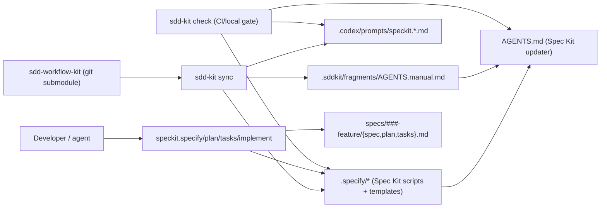

# sdd-workflow-kit

[](https://github.com/yshishenya/sdd-workflow-kit/actions/workflows/smoke-speckit.yml)
[](https://github.com/yshishenya/sdd-workflow-kit/releases)
[](https://www.python.org/)

`sdd-workflow-kit` подключается к любому репозиторию как `git submodule` и дает CLI `sdd-kit`.

CLI безопасно и идемпотентно синхронизирует в проект «управляемые» файлы (шаблоны/скрипты/доки/CI), чтобы ваш процесс разработки был:

- повторяемым между репозиториями
- обновляемым через пин по git тегу/SHA
- проверяемым в CI (drift-check)

## Содержание

- [Что это](#что-это)
- [Зачем](#зачем)
- [Как это работает](#как-это-работает)
- [Установка в проект (админу)](#установка-в-проект-админу)
- [Как пользоваться (разработчику)](#как-пользоваться-разработчику)
- [CI: drift-check](#ci-drift-check)
- [Обновления (админу)](#обновления-админу)
- [Опционально: Memory Bank](#опционально-memory-bank)
- [Опционально: Skillpacks](#опционально-skillpacks)
- [Troubleshooting](#troubleshooting)

## Что это

Внутри два ключевых элемента:

- `bin/sdd-kit` (Python CLI): `bootstrap`, `sync`, `check`, `detect`, плюс управление skillpacks.
- `sddkit/_templates/*`: шаблоны, из которых `sync` генерирует managed-файлы в ваших проектах.

Отдельно поддерживается режим **Spec Kit** (GitHub `spec-kit`) как каноничный SDD пайплайн. В этом режиме `sdd-kit`:

- ставит `.specify/*` (скрипты/шаблоны Spec Kit) из pinned upstream
- генерирует команды агента `speckit.*` (например, для Codex: `.codex/prompts/speckit.plan.md`)
- проверяет дрейф инфраструктуры (а не ваших фичевых артефактов)

## Зачем

Проблема: хороший процесс (SDD, инструкции агенту, CI-гейты, шаблоны доков) сложно «разносить» по многим репозиториям.

Решение: один репозиторий-kit как источник правды + submodule в каждом проекте.

- Подключили submodule.
- Запустили `bootstrap` один раз.
- Дальше `sync` обновляет только managed-файлы.
- `check` в CI ловит дрейф.

Важно: по умолчанию включен **safe mode**: kit не перезаписывает неуправляемые (чужие) файлы.

## Как это работает

Коротко:

- `.sddkit/config.toml` в проекте определяет, чем управляет kit.
- `sdd-kit sync` вычисляет «ожидаемое состояние» и приводит managed-файлы к нему.
- `sdd-kit check` сравнивает факт с ожиданием и падает на `DRIFT/MISSING/UNMANAGED`.
- В **Spec Kit mode** фичевые артефакты (`specs/**`) создаются самим Spec Kit и **не** drift-check’аются.



Где смотреть подробную инструкцию внутри конкретного проекта:

- `docs/SDD/README.md` (managed-документ, обновляется через `sdd-kit sync`)

## Установка в проект (админу)

### 1) Подключить kit как submodule

Рекомендуемый путь:

```bash
git submodule add git@github.com:yshishenya/sdd-workflow-kit.git .tooling/sdd-workflow-kit
```

### 2) Инициализировать submodules

```bash
git submodule update --init --recursive
```

### 3) Bootstrap (создать конфиг и сразу синхронизировать managed-файлы)

SDD через Spec Kit (рекомендуется для новых фич):

```bash
python3 .tooling/sdd-workflow-kit/bin/sdd-kit bootstrap --project . --profile speckit --locale ru
```

Memory Bank + `meta/*` scaffolding (Airis-профиль):

```bash
python3 .tooling/sdd-workflow-kit/bin/sdd-kit bootstrap --project . --profile airis --locale ru
```

Нейтральный профиль (без лишнего):

```bash
python3 .tooling/sdd-workflow-kit/bin/sdd-kit bootstrap --project . --profile generic --locale ru
```

`bootstrap`:

- создаст `.sddkit/config.toml` (если его еще нет)
- запустит `sync`

### 4) Закоммитить изменения

После `bootstrap` обычно появляются новые managed-файлы (доки/скрипты/CI). Закоммитьте их вместе с добавлением submodule.

## Как пользоваться (разработчику)

### 0) После `git clone`

Если репозиторий использует submodules:

```bash
git submodule update --init --recursive
```

### 1) SDD цикл (Spec Kit)

Рекомендуемый путь: использовать команды агента `speckit.*`.

1. `speckit.specify`
2. `speckit.plan`
3. `speckit.tasks`
4. `speckit.implement`

Артефакты фичи лежат в `specs/###-feature-name/`.

### 2) Перед PR

```bash
python3 .tooling/sdd-workflow-kit/bin/sdd-kit check --project .
```

Если `check` упал на `DRIFT/MISSING`:

```bash
python3 .tooling/sdd-workflow-kit/bin/sdd-kit sync --project .
```

## CI: drift-check

Есть два подхода.

- Подход A (рекомендуется, обязателен для `manage.speckit=true`): запускать `sdd-kit check` прямо из submodule в проекте.
- Подход B: использовать composite action из этого репо (удобно, но не подходит для Spec Kit mode).

Важно для Spec Kit mode: checkout должен быть с `submodules: recursive`.

## Обновления (админу)

### Обновить `sdd-workflow-kit` в проекте

1. Обновите указатель submodule на новый тег:

```bash
cd .tooling/sdd-workflow-kit
git fetch --tags origin
git checkout vX.Y.Z
cd ../..
```

2. Подтяните nested submodules:

```bash
git submodule update --init --recursive
```

3. Пересинхронизируйте managed-файлы и проверьте дрейф:

```bash
python3 .tooling/sdd-workflow-kit/bin/sdd-kit sync --project .
python3 .tooling/sdd-workflow-kit/bin/sdd-kit check --project .
```

4. Закоммитьте изменения (обновление submodule + обновленные managed-файлы).

### Обновить upstream Spec Kit (только для мейнтейнеров этого kit)

Upstream Spec Kit живет как submodule: `upstreams/spec-kit` (пин по SHA).

Процедура:

1. Обновить указатель submodule на нужный тег/коммит.
2. Прогнать `python3 scripts/smoke_speckit.py`.
3. Выпустить новую версию kit (тег/релиз).

## Опционально: Memory Bank

Memory Bank это отдельный слой (`meta/memory_bank/*`). Он не конфликтует со Spec Kit.

Включается флагами в `.sddkit/config.toml`:

```toml
[manage]
memory_bank = true
meta_tools = true
meta_sdd = true
```

Затем:

```bash
python3 .tooling/sdd-workflow-kit/bin/sdd-kit sync --project .
```

## Опционально: Skillpacks

Перенести локальные Codex skills в kit (чтобы kit был самодостаточным):

```bash
python3 bin/sdd-kit import-codex-skills --from "$HOME/.codex/skills" --pack codex
```

Установить skills в проект:

```bash
python3 .tooling/sdd-workflow-kit/bin/sdd-kit install-skills --project . --to project
```

## Troubleshooting

### `UNMANAGED ... (safe_mode)`

Это значит: файл уже существует, но он не помечен как managed. В safe mode kit его не трогает.

Варианты:

- переименовать/удалить файл и снова `sync`
- выключить управление этим файлом в `[manage]`

### В CI не виден `upstreams/spec-kit`

Почти всегда причина: забыли `submodules: recursive` в `actions/checkout`.

### Spec Kit ругается на ветку

Spec Kit ожидает ветки вида `001-feature-name`. Создавайте фичи через `speckit.specify`.

## Требования

- Git (submodule)
- Python 3.11+

## Лицензии

- Upstream `github/spec-kit` (MIT) вендорится как submodule и устанавливается в проекты как managed файлы.
- См. `THIRD_PARTY_NOTICES.md`.
