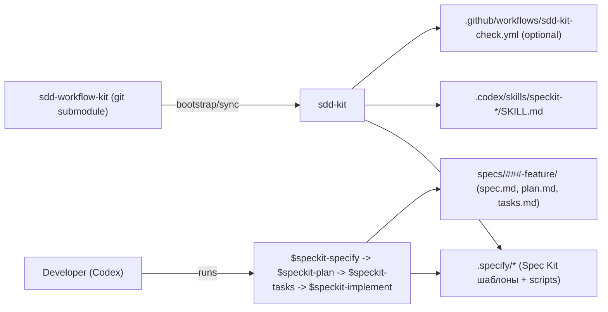

# sdd-workflow-kit

[](https://github.com/yshishenya/sdd-workflow-kit/actions/workflows/smoke-speckit.yml)
[](https://github.com/yshishenya/sdd-workflow-kit/releases)
[](https://www.python.org/)

Language: [🇬🇧 English](#lang-en) (collapse by default) | [🇷🇺 Русский](#lang-ru) (default)

<a id="lang-en"></a>
<details>
<summary>English</summary>

`sdd-workflow-kit` is a **git submodule** that installs a reproducible Spec-Driven Development workflow into any repository.

Core idea:

- Use **GitHub Spec Kit** as the single canonical SDD loop: `spec.md -> plan.md -> tasks.md -> implement`
- Use `sdd-kit` (this repo) as an overlay to make the infrastructure **pinned**, **safe**, and **drift-checkable**

---

## What You Get

- `sdd-kit bootstrap`: create `.sddkit/config.toml` and run an initial sync
- `sdd-kit sync`: install/update kit-managed infrastructure (safe + idempotent)
- `sdd-kit check`: drift gate for CI (fails on `DRIFT/MISSING/UNMANAGED`)
- Optional scaffold: seed a repo-local **Memory Bank** (`meta/memory_bank/`) as a knowledge base
- Spec Kit mode: installs `.specify/*` and generates **Codex skills** `speckit-*` (so you run commands as `$speckit-plan`, etc.)

---

## How It Works (High Level)


Key ownership rules:

- `.specify/**`: managed by `sdd-kit` (copied from a pinned Spec Kit upstream). Drift-checked.
- `.codex/skills/speckit-*/SKILL.md`: managed by `sdd-kit`. Drift-checked.
- `specs/**`: feature artifacts (human-readable Markdown). Not drift-checked.
- `AGENTS.md`: generated/updated by Spec Kit (`update-agent-context.*`). `sdd-kit` only patches the MANUAL block in Spec Kit mode.

---

## Install (Repo Admin)

### 1) Add the kit as a submodule

```bash
git submodule add git@github.com:yshishenya/sdd-workflow-kit.git .tooling/sdd-workflow-kit
git submodule update --init --recursive
```

### 2) Bootstrap (recommended: Spec Kit profile)

```bash
python3 .tooling/sdd-workflow-kit/bin/sdd-kit bootstrap --project . --profile speckit --locale en
```

Profiles:

- `speckit`: installs Spec Kit infrastructure + `speckit-*` skills (recommended)
- `memory_bank`: seeds `meta/memory_bank/*` (editable, seed-only)
- `generic`: minimal scaffolds (AGENTS.md, docs templates, optional CI drift gate)
- `airis`: deprecated alias for `memory_bank` (kept for compatibility)

Note:

- `memory_bank` and deprecated `airis` enable only `manage.memory_bank=true` by default.
- Existing repos that already explicitly set legacy flags (`manage.meta_tools`, `manage.meta_sdd`, `manage.codex_scaffold`) keep their values.
- New bootstraps will not auto-enable legacy `meta_*` scaffolds; enable those in `.sddkit/config.toml` only when you need old workflows.

### 3) Commit what was added

`bootstrap` typically creates/updates managed files under:

- `.sddkit/`
- `docs/` (templates)
- `.specify/` (Spec Kit infrastructure, in `speckit` mode)
- `.codex/skills/` (in `speckit` mode)
- `.github/workflows/` (if GitHub Actions exists)

Commit them together with the submodule pointer.

---

## Daily Use (Developer)

### 0) After `git clone`

```bash
git submodule update --init --recursive
```

### 1) Run the SDD loop (Spec Kit)

Run these in Codex as skills:

1. `$speckit-specify`
2. `$speckit-plan`
3. `$speckit-tasks`
4. `$speckit-implement`

Artifacts are created under:

- `specs/###-feature-name/spec.md`
- `specs/###-feature-name/plan.md`
- `specs/###-feature-name/tasks.md`

### 2) Before opening a PR

```bash
python3 .tooling/sdd-workflow-kit/bin/sdd-kit check --project .
```

---

## Spec Kit Skills (Command Reference)

All Spec Kit commands are installed as **Codex skills** and invoked like:

- `$speckit-specify`
- `$speckit-plan`
- `$speckit-tasks`
- `$speckit-implement`

Important behaviour:

- If the skill references `.specify/scripts/...`, the agent must execute the script first via terminal.
- Script output (often JSON) is the source of truth; only inspect script source if execution fails.

### `$speckit-specify`

Purpose:

- Start a new feature by creating the feature folder and `spec.md`.

Input:

- A short natural-language description of *what* you want (avoid implementation detail).

Creates/updates:

- A new `specs/###-<slug>/` directory
- `specs/###-<slug>/spec.md`
- Usually creates and checks out a new feature branch

Current installed `speckit-*` skills in this kit are:

- `$speckit-specify`
- `$speckit-clarify`
- `$speckit-plan`
- `$speckit-planreview` (overlay, multi-model)
- `$speckit-tasks`
- `$speckit-analyze`
- `$speckit-implement`
- `$speckit-checklist`
- `$speckit-constitution`
- `$speckit-taskstoissues`

If you use `$speckit-*`, these SKILLs are generated from upstream Spec Kit templates plus the overlay command.

### `$speckit-clarify`

Purpose:

- Identify ambiguities in `spec.md`, ask targeted questions, and encode clarifications back into the spec.

Use when:

- You cannot confidently plan without making assumptions.

### `$speckit-plan`

Purpose:

- Turn `spec.md` into an implementable technical plan.

Creates/updates (typical):

- `specs/###-<slug>/plan.md`
- Design artifacts (contracts, data model, quickstart, research notes)
- `AGENTS.md` via Spec Kit’s `update-agent-context` script

### `$speckit-planreview` (overlay, multi-model)

Purpose:

- Advisory multi-model review of the current feature’s `spec.md/plan.md/tasks.md` (no code changes).

Output:

- Writes a review note under `specs/###-<slug>/reviews/planreview.md` (or similar).

### `$speckit-tasks`

Purpose:

- Generate a dependency-ordered `tasks.md` from `spec.md` + `plan.md`.

Creates/updates:

- `specs/###-<slug>/tasks.md`

### `$speckit-analyze`

Purpose:

- Non-destructive quality check across `spec.md`, `plan.md`, and `tasks.md` to catch inconsistencies.

Use when:

- Before implementation or before PR.

### `$speckit-implement`

Purpose:

- Execute `tasks.md` end-to-end: implement code, add tests, update tasks status.

Expectations:

- Works incrementally and keeps the repo in a passing state (or clearly reports what’s broken).

### `$speckit-checklist`

Purpose:

- Generate or update a checklist for the current feature based on requirements (quality gate).

### `$speckit-constitution`

Purpose:

- Create/update `.specify/memory/constitution.md` (project principles and constraints).

Note:

- `sdd-kit` creates the file if missing, but does not overwrite it later.

### `$speckit-taskstoissues`

Purpose:

- Convert `tasks.md` into GitHub issues (optional).

---

## AGENTS.md (How It Is Generated)

Policy:

- `AGENTS.md` is always in English (single standard across repos).
- User-facing communication language should follow `.sddkit/config.toml` -> `[sddkit].locale`.

In **Spec Kit mode**:

- Spec Kit script `update-agent-context` creates/updates `AGENTS.md` (usually during `$speckit-plan`).
- `sdd-kit sync` patches only the `MANUAL ADDITIONS` block.

The patched MANUAL block contains:

- an **auto-generated** section derived from the repo structure/docs
- a **team notes** section from `.sddkit/fragments/AGENTS.manual.md`

Do not edit `AGENTS.md` directly; edit `.sddkit/fragments/AGENTS.manual.md` instead, then run:

```bash
python3 .tooling/sdd-workflow-kit/bin/sdd-kit sync --project .
```

---

## Memory Bank (Optional)

Enable:

```bash
python3 .tooling/sdd-workflow-kit/bin/sdd-kit bootstrap --project . --profile memory_bank
```

What it does:

- seeds `meta/memory_bank/*` with editable templates
- does not overwrite existing Memory Bank content on later syncs

Modes (optional):

- Default is seed-only: `manage.memory_bank_mode = "seed"` (recommended; no content drift-check).
- If you want enforcement (not recommended for most repos): set `manage.memory_bank_mode = "managed"` to make Memory Bank files kit-managed and drift-checked.

---

## Codex Scaffold (Optional)

If you want a repo-local Codex environment scaffold under `.codex/`:

1. Set `manage.codex_scaffold = true` in `.sddkit/config.toml`
2. Run `python3 .tooling/sdd-workflow-kit/bin/sdd-kit sync --project .`

Modes:

- Default is seed-only: `manage.codex_scaffold_mode = "seed"`
- Set `manage.codex_scaffold_mode = "managed"` only if you want drift-check enforcement

---

## Legacy JSON SDD (Optional)

If you still use the legacy JSON-based SDD workflow (separate from Spec Kit), enable these:

1. Set in `.sddkit/config.toml`:

```toml
[manage]
meta_tools = true
meta_sdd = true
```

2. Then run:

```bash
python3 .tooling/sdd-workflow-kit/bin/sdd-kit sync --project .
python3 .tooling/sdd-workflow-kit/bin/sdd-kit check --project .
```

Notes:

- If you use Spec Kit (`--profile speckit`), you typically want `meta_*` disabled to avoid having two SDD systems in the same repo.

---

## CI Drift Gate

If the repo has GitHub Actions, the kit can install a workflow that runs:

```bash
python3 .tooling/sdd-workflow-kit/bin/sdd-kit check --project . --config .sddkit/config.toml
```

This ensures the Spec Kit infrastructure and skills do not drift across repositories.

---

## Updating

### Update the kit in a target repo (admin)

1. Update submodules:

```bash
git submodule update --init --recursive
```

2. Bump the kit submodule pointer (example: checkout a new tag inside the submodule):

```bash
cd .tooling/sdd-workflow-kit
git fetch --tags
git checkout <tag-or-sha>
cd -
git add .tooling/sdd-workflow-kit
git commit -m "chore(tooling): bump sdd-workflow-kit"
```

3. Apply updates and validate:

```bash
python3 .tooling/sdd-workflow-kit/bin/sdd-kit sync --project .
python3 .tooling/sdd-workflow-kit/bin/sdd-kit check --project .
```

### Update Spec Kit upstream (maintainers of this kit)

Spec Kit is vendored as a submodule:

- `upstreams/spec-kit`

Update flow:

```bash
cd upstreams/spec-kit
git fetch --tags
git checkout <tag-or-sha>
cd -
git add upstreams/spec-kit
git commit -m "chore(upstreams): bump spec-kit"

python3 scripts/smoke_speckit.py
```

Then publish a new release tag for `sdd-workflow-kit`.

---

## Troubleshooting

### I see duplicate `$speckit-*` commands in Codex

This usually means you installed the skills in two places:

- global: `~/.codex/skills`
- project: `.codex/skills`

Pick one location and remove the other copy.

### A `$speckit-*` skill reads scripts instead of running them

The correct flow is “script-first”.

- Run `sdd-kit sync` to ensure you have the latest skill templates.
- Restart Codex / start a new chat if the UI caches skills.

</details>

<a id="lang-ru"></a>

---

## Русский / RU

`sdd-workflow-kit` — это **submodule** для установки воспроизводимого SDD-пайплайна в репозиторий.

Идея:

- Как единую каноническую модель SDD используется **GitHub Spec Kit**: `spec.md -> plan.md -> tasks.md -> implement`
- Роль overlay берёт на себя `sdd-kit` (этот репозиторий): инфраструктура становится **переиспользуемой, безопасной и drift-checkable**.

---

## Что даёт кит

- `sdd-kit bootstrap`: создать `.sddkit/config.toml` и выполнить начальную синхронизацию
- `sdd-kit sync`: установить/обновить управляемые артефакты (safe + idempotent)
- `sdd-kit check`: gate для CI (падает на `DRIFT/MISSING/UNMANAGED`)
- Дополнительно: инициализировать локальный **Memory Bank** (`meta/memory_bank/`) как базу знаний
- Режим Spec Kit устанавливает `.specify/*` и генерирует **Codex skills** `speckit-*` (вызов как `$speckit-plan` и т.д.)

---

## Как это устроено



Правила владения:

- `.specify/**`: управляется `sdd-kit` из pinned-версии Spec Kit (drift-check).
- `.codex/skills/speckit-*/SKILL.md`: управляется `sdd-kit`. Drift-checkируется.
- `specs/**`: артефакты фичи в читаемом markdown, не проверяются на drift.
- `AGENTS.md`: создаётся/обновляется `update-agent-context` из Spec Kit; в режиме `speckit` `sdd-kit` корректирует только `MANUAL ADDITIONS` block.

---

## Установка (для админа репозитория)

### 1) Подключить submodule

```bash
git submodule add git@github.com:yshishenya/sdd-workflow-kit.git .tooling/sdd-workflow-kit
git submodule update --init --recursive
```

### 2) Bootstrap (рекомендовано: `--profile speckit`)

```bash
python3 .tooling/sdd-workflow-kit/bin/sdd-kit bootstrap --project . --profile speckit --locale en
```

Профили:

- `speckit`: ставит инфраструктуру Spec Kit + `speckit-*` skills (рекомендуется)
- `memory_bank`: инициализирует `meta/memory_bank/*` (редактируемый seed-only режим)
- `generic`: минимальные скелеты (`AGENTS.md`, шаблоны docs, опционально CI drift gate)
- `airis`: deprecated alias для `memory_bank` (оставлен для обратной совместимости)

Важно:

- `memory_bank` и deprecated `airis` по умолчанию включают только `manage.memory_bank=true`.
- В уже существующих репозиториях уже заданные legacy-флаги (`manage.meta_tools`, `manage.meta_sdd`, `manage.codex_scaffold`) сохраняются.
- Для новых `bootstrap` legacy `meta_*` больше не включаются автоматически; включайте их вручную в `.sddkit/config.toml`, если вам нужен старый SDD-флоу.

### 3) Зафиксировать изменения

Обычно создаются/обновляются:

- `.sddkit/`
- `docs/` (templates)
- `.specify/` (в режиме `speckit`)
- `.codex/skills/` (в режиме `speckit`)
- `.github/workflows/` (если GitHub Actions уже есть)

Коммитить вместе с изменением submodule-поинтера.

---

## Повседневная работа (разработчик)

### 0) После `git clone`

```bash
git submodule update --init --recursive
```

### 1) SDD loop (Spec Kit)

В Codex запускай как скиллы:

1. `$speckit-specify`
2. `$speckit-plan`
3. `$speckit-tasks`
4. `$speckit-implement`

Артефакты:

- `specs/###-feature-name/spec.md`
- `specs/###-feature-name/plan.md`
- `specs/###-feature-name/tasks.md`

### 2) Перед PR

```bash
python3 .tooling/sdd-workflow-kit/bin/sdd-kit check --project .
```

---

## Набор команд Spec Kit (`speckit-*`)

Эти команды поставляются как **Codex skills**:

- `$speckit-specify`
- `$speckit-clarify`
- `$speckit-plan`
- `$speckit-planreview` (overlay, multi-model review)
- `$speckit-tasks`
- `$speckit-analyze`
- `$speckit-implement`
- `$speckit-checklist`
- `$speckit-constitution`
- `$speckit-taskstoissues`

Ключевое поведение:

- Если скилл обращается к `.specify/scripts/...`, нужно выполнить скрипт в терминале.
- Источник правды — вывод скриптов (обычно JSON), не файл-описание.

### Кратко по командам

- `$speckit-specify` — создать фичу и `spec.md`.
- `$speckit-clarify` — найти неоднозначности и зафиксировать уточнения в `spec.md`.
- `$speckit-plan` — сгенерировать технический `plan.md`, артефакты и обновить `AGENTS.md`.
- `$speckit-tasks` — создать/обновить `tasks.md`.
- `$speckit-planreview` — мульти-модельный обзор без внесения изменений.
- `$speckit-analyze` — проверка согласованности `spec.md/plan.md/tasks.md`.
- `$speckit-implement` — выполнить задачи по `tasks.md`.
- `$speckit-checklist` — чеклист для текущей фичи.
- `$speckit-constitution` — создать/обновить `.specify/memory/constitution.md`.
- `$speckit-taskstoissues` — разложить `tasks.md` в GitHub issues (по желанию).

---

## AGENTS.md: как генерируется

Политика:

- `AGENTS.md` всегда только на English.
- Язык общения для людей задаётся через `.sddkit/config.toml` → `[sddkit].locale`.

В режиме `speckit`:

- `AGENTS.md` создаёт Spec Kit (`update-agent-context`), обычно во время `$speckit-plan`.
- `sdd-kit sync` обновляет только блок `MANUAL ADDITIONS`.
- Этот блок формируется из:
  - автораздела с repo-схемой
  - `.sddkit/fragments/AGENTS.manual.md`

Не редактируй `AGENTS.md` вручную — меняй `.sddkit/fragments/AGENTS.manual.md`, затем:

```bash
python3 .tooling/sdd-workflow-kit/bin/sdd-kit sync --project .
```

---

## Memory Bank (необязательный)

Включить:

```bash
python3 .tooling/sdd-workflow-kit/bin/sdd-kit bootstrap --project . --profile memory_bank
```

Что делает:

- создаёт `meta/memory_bank/*` из шаблонов
- не перезаписывает существующий контент при последующих sync

Режимы:

- `manage.memory_bank_mode = "seed"` (по умолчанию)
- `manage.memory_bank_mode = "managed"` (опционально, включает строгий drift-check)

---

## Codex scaffold (необязательный)

1. `manage.codex_scaffold = true` в `.sddkit/config.toml`
2. `python3 .tooling/sdd-workflow-kit/bin/sdd-kit sync --project .`

Режимы:

- по умолчанию `manage.codex_scaffold_mode = "seed"`
- `manage.codex_scaffold_mode = "managed"` только если нужен жесткий контроль изменений

---

## Legacy JSON SDD (необязательно)

Если нужен старый JSON-подход, включи:

```toml
[manage]
meta_tools = true
meta_sdd = true
```

И затем:

```bash
python3 .tooling/sdd-workflow-kit/bin/sdd-kit sync --project .
python3 .tooling/sdd-workflow-kit/bin/sdd-kit check --project .
```

Совместно с `--profile speckit` обычно `meta_*` лучше не включать, чтобы не смешивать два SDD-флоу.

---

## CI gate

Если в репозитории есть GitHub Actions, можно поставить workflow, который выполняет:

```bash
python3 .tooling/sdd-workflow-kit/bin/sdd-kit check --project . --config .sddkit/config.toml
```

Так контролируется отсутствующий drift инфраструктуры Spec Kit и skills.

---

## Обновление

### Обновить кит в целевом репозитории (админ)

1. Инициализировать/обновить подмодули:

```bash
git submodule update --init --recursive
```

2. Обновить поинтер submodule на новый тег/sha:

```bash
cd .tooling/sdd-workflow-kit
git fetch --tags
git checkout <tag-or-sha>
cd -
git add .tooling/sdd-workflow-kit
git commit -m "chore(tooling): bump sdd-workflow-kit"
```

3. Применить и проверить:

```bash
python3 .tooling/sdd-workflow-kit/bin/sdd-kit sync --project .
python3 .tooling/sdd-workflow-kit/bin/sdd-kit check --project .
```

### Обновить Spec Kit upstream (для мейнтейнеров этого кита)

`upstreams/spec-kit`:

```bash
cd upstreams/spec-kit
git fetch --tags
git checkout <tag-or-sha>
cd -
git add upstreams/spec-kit
git commit -m "chore(upstreams): bump spec-kit"

python3 scripts/smoke_speckit.py
```

После этого создать новый release `sdd-workflow-kit`.

---

## Проблемы и решения

### Дублируются команды `$speckit-*` в Codex

Обычно скиллы установлены в двух местах:

- `~/.codex/skills`
- `.codex/skills`

Оставь только один источник.

### Скилл `$speckit-*` показывает текст скрипта вместо запуска

Правильный порядок: сначала синк скиллов и скриптов.

- `sdd-kit sync`
- Перезапуск/новый чат в Codex при кэшировании.
